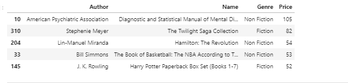

# kaggle-challenge-LMF

In this challenge Maryame El Omari, Francesca Bormioli and Lucas Kustermans visualize some interesting datapoints from a dataset that we found on Kaggle.com.
	- This is the dataset we took: https://www.kaggle.com/sootersaalu/amazon-top-50-bestselling-books-2009-2019

## Plot 1: Top 10 of most appearances of authors in the dataset
Who are the bestselling authors from 2009 until 2019 on Amazon?

## Plot 2: Price vs Rating
Is there a relation between the price of a book and its user rating? We clearly show that there is not a relation.

## Plot 3: 

## Plot 4:

## Plot 5: 

